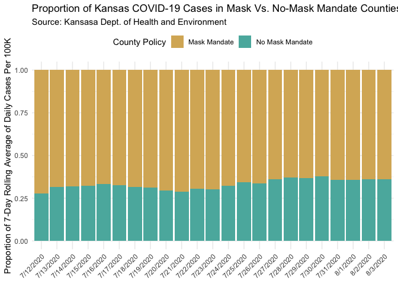

Lab 07 - Conveying the right message through visualisation
================
Noah Booker
4/2/25

### Load packages and data

``` r
library(tidyverse) 
```

### Exercise 1

Create a data frame that can be used to re-construct the misleading
visualization of COVID cases according to masking.

``` r
df <- tribble(
  ~date, ~mask, ~nomask,
  "7/12/2020", 25.4, 9.8,
  "7/13/2020", 19.7, 9.1,
  "7/14/2020", 19.6, 9.2,
  "7/15/2020", 20.5, 9.8,
  "7/16/2020", 19.7, 9.9,
  "7/17/2020", 19.7, 9.5,
  "7/18/2020", 20.5, 9.4,
  "7/19/2020", 19.9, 9.1,
  "7/20/2020", 20.6, 8.6,
  "7/21/2020", 21.2, 8.6,
  "7/22/2020", 19.8, 8.7,
  "7/23/2020", 19.8, 8.6,
  "7/24/2020", 20.5, 9.8,
  "7/25/2020", 19.0, 9.9,
  "7/26/2020", 19.7, 10.0,
  "7/27/2020", 17.0, 9.6,
  "7/28/2020", 16.2, 9.6,
  "7/29/2020", 16.4, 9.6,
  "7/30/2020", 16.5, 10.0,
  "7/31/2020", 16.0, 8.9,
  "8/1/2020", 16.1, 9.0,
  "8/2/2020", 15.8, 8.9,
  "8/3/2020", 15.9, 9.0
)
```

After trying to make a graph, I realized that I maybe want the data
structured differently.

``` r
df <- df %>% 
  pivot_longer(
    mask:nomask, 
    names_to = "mask", 
    values_to = "cases")
df
```

    ## # A tibble: 46 × 3
    ##    date      mask   cases
    ##    <chr>     <chr>  <dbl>
    ##  1 7/12/2020 mask    25.4
    ##  2 7/12/2020 nomask   9.8
    ##  3 7/13/2020 mask    19.7
    ##  4 7/13/2020 nomask   9.1
    ##  5 7/14/2020 mask    19.6
    ##  6 7/14/2020 nomask   9.2
    ##  7 7/15/2020 mask    20.5
    ##  8 7/15/2020 nomask   9.8
    ##  9 7/16/2020 mask    19.7
    ## 10 7/16/2020 nomask   9.9
    ## # ℹ 36 more rows

### Exercise 2

Make a visualization that more accurately (and honestly) reflects the
data and conveys a clear message.

``` r
df %>% 
  ggplot(aes(x = date, y = cases, color = mask, group = mask)) +
  geom_line() +
  labs(title = "Kansas COVID-19 Cases in Mask Vs. No-Mask Mandate Counties", subtitle = "Source: Kansasa Dept. of Health and Environment", y = "7-Day Rolling Average of Daily Cases Per 100K", x = NULL, color = "County Policy") +
  theme_minimal() +
  theme(
    axis.text.x = element_text(angle = 45, hjust = 1),
  legend.position = "top") +
  scale_color_manual(
    values = c("mask" = "#d8b365", "nomask" = "#5ab4ac"),
    labels = c("mask" = "Mask Mandate", "nomask" = "No Mask Mandate")
  )
```

<!-- -->

### Exercise 3

What message is more clear in your visualization than it was in the
original visualization?

The original visualization was misleading viewers with two different
scales for each line to depict that counties with mask mandates were
experiencing decreases in COVID cases which were bringing their average
lower than counties with no mask mandate. My visualization uses the same
scale for each line and shows more clearly that, while counties with
mask mandates did experience decreases and counties with no mask
mandates did not, counties with no mask mandates had fewer average COVID
cases across the range of dates displayed in the graph.

### Exercise 4

What, if any, useful information do these data and your visualization
tell us about mask wearing and COVID? It’ll be difficult to set aside
what you already know about mask wearing, but you should try to focus
only on what this visualization tells. Feel free to also comment on
whether that lines up with what you know about mask wearing.

This visualization shows that counties with mask mandates showed an
overall slight decrease in average COVID cases over a 23 day period.
Over that same period, counties with no mask mandates showed little
change in average COVID cases, but they consistently had fewer average
cases than counties with mask mandates. The trend of the cases in the
mask mandate counties suggest that mask mandates may be effective in
lowering COVID cases. I’m not sure how to interpret the striking
difference in absolute COVID cases between mask and no mask counties.
There may be a third variable that explains the difference in absolute
cases in mask vs. no mask counties. Perhaps no mask counties are rural
counties where transmission is low even without masks.

### Exercise 5

Reflect on the message conveyed by your accurate visualization regarding
mask-wearing and COVID-19. Discuss the key factors that contribute to
this message, such as the variables used, the scale of the axes, and the
type of visualization.

I describe the message conveyed by the visualization above. In sum, it
shows that mask mandates seem to be associated with decreases in COVID
and that counties with no mask mandates show no change in COVID rates
but have overall fewer COVID cases. The variables used where the ones I
was given. They are y = 7-day rolling average of daily COVID cases per
100K people in Kansas counties, x1 = date, x2 = presence of mask mandate
policy in county. They seem like adequate variables to capture what’s
going on. Using the same scale on the y-axis for both lines is crucial
to capture everything that’s going on in the data (at least what’s
described above). The line graph is appropriate for showing change over
time.

### Exercise 6

Plan Your Opposite Visualization: Briefly determine what opposite
message you want to covey. Consider the data you have available (or
could easily add).

Instead of plotting change over time, for each date I could plot the
proportion of the “7-Day Rolling Average of Daily Cases/Per 100K” that
each type of county contributes. So, instead of depicting the fact that
COVID cases decreased in counties with mask mandates (suggesting that
masking is effective at lowering COVID rates), the visualization will
capitalize on the difference in total of number of cases to focus on the
fact that most of the COVID cases are happening in counties with
mask-mandates, ignoring any change in cases over time (now suggesting
the opposite—that masking is ineffective or even counterproductive to
lowering COVID rates).

### Exercise 7

Use visualization techniques to craft a chart or graph that conveys this
contrary perspective. Pay careful attention to how different
visualization choices, like altering the y-axis scale or changing the
chart type, can influence the message received by the audience.

``` r
#Going back to wide before adding new total variable.
df <- df %>%
  pivot_wider(names_from = mask, values_from = cases) %>% 
  mutate(total = rowSums(across(c(mask, nomask))))

#Back to long.
df <- df %>% 
  pivot_longer(
    mask:nomask, 
    names_to = "mask", 
    values_to = "cases")

#Creating proportion variable.
df <- df %>%
  mutate(proportion = cases / total)
  
#Plotting.
df %>% 
  ggplot(aes(x = date, y = proportion, fill = mask)) +
  geom_col() +
  labs(title = "Proportion of Kansas COVID-19 Cases in Mask Vs. No-Mask Mandate Counties", subtitle = "Source: Kansasa Dept. of Health and Environment", y = "Proportion of 7-Day Rolling Average of Daily Cases Per 100K", x = NULL, fill = "County Policy") +
  theme_minimal() +
  theme(
    axis.text.x = element_text(angle = 45, hjust = 1),
  legend.position = "top") +
  scale_fill_manual(
    values = c("mask" = "#d8b365", "nomask" = "#5ab4ac"),
    labels = c("mask" = "Mask Mandate", "nomask" = "No Mask Mandate")
  )
```

<!-- -->
