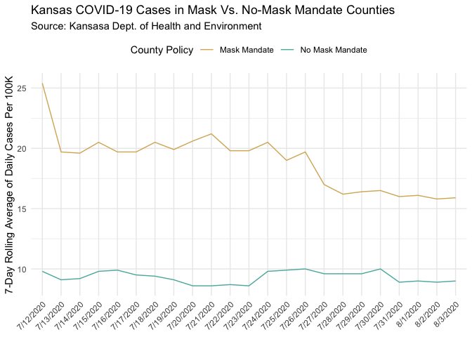

Lab 07 - Conveying the right message through visualisation
================
Noah Booker
4/2/25

### Load packages and data

``` r
library(tidyverse) 
```

### Exercise 1

Create a data frame that can be used to re-construct the misleading
visualization of COVID cases according to masking.

``` r
df <- tribble(
  ~date, ~mask, ~nomask,
  "7/12/2020", 25.4, 9.8,
  "7/13/2020", 19.7, 9.1,
  "7/14/2020", 19.6, 9.2,
  "7/15/2020", 20.5, 9.8,
  "7/16/2020", 19.7, 9.9,
  "7/17/2020", 19.7, 9.5,
  "7/18/2020", 20.5, 9.4,
  "7/19/2020", 19.9, 9.1,
  "7/20/2020", 20.6, 8.6,
  "7/21/2020", 21.2, 8.6,
  "7/22/2020", 19.8, 8.7,
  "7/23/2020", 19.8, 8.6,
  "7/24/2020", 20.5, 9.8,
  "7/25/2020", 19.0, 9.9,
  "7/26/2020", 19.7, 10.0,
  "7/27/2020", 17.0, 9.6,
  "7/28/2020", 16.2, 9.6,
  "7/29/2020", 16.4, 9.6,
  "7/30/2020", 16.5, 10.0,
  "7/31/2020", 16.0, 8.9,
  "8/1/2020", 16.1, 9.0,
  "8/2/2020", 15.8, 8.9,
  "8/3/2020", 15.9, 9.0
)
```

After trying to make a graph, I realized that I maybe want the data
structured differently.

``` r
df <- df %>% 
  pivot_longer(
    mask:nomask, 
    names_to = "mask", 
    values_to = "cases")
```

### Exercise 2

Make a visualization that more accurately (and honestly) reflects the
data and conveys a clear message.

``` r
df %>% 
  ggplot(aes(x = date, y = cases, color = mask, group = mask)) +
  geom_line()
```

<!-- -->
